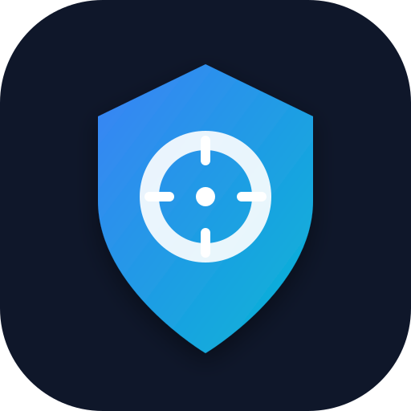

<div align="center">



# 🛡️ ScamSnipper AI

### *Outsmart scams. Protect your digital life.*

<p>
  <a href="https://github.com/sumitsharma29/scamsnipper/stargazers">
    
  </a>
  <a href="https://github.com/sumitsharma29/scamsnipper/network/members">
    
  </a>
  
  
  
  
  
</p>

<p>
  <a href="#-features">Features</a> •
  <a href="#-tech-stack">Tech Stack</a> •
  <a href="#-getting-started">Getting Started</a> •
  <a href="#-pages">Pages</a> •
  <a href="#-developer">Developer</a>
</p>

---

> **ScamSnipper AI** is an intelligent, real-time fraud detection platform built for India.  
> Analyze URLs, SMS, voice calls, and images — instantly, offline, and privately.

</div>

---

## ✨ Features

| Feature | Description |
|---|---|
| 🔍 **URL Scanner** | Detects phishing patterns, suspicious domains, IP-based URLs, and malicious subdomains |
| 💬 **SMS Analyzer** | Scans messages for scam keywords, urgency signals, and suspicious links |
| 🎙️ **Voice Detector** | Analyzes call transcripts for high-pressure tactics and scam indicators |
| 🖼️ **Image Scanner** | Flags suspicious filenames and malformed attachments |
| 🗺️ **Threat Heatmap** | Live scam activity map across India with user-reported incidents |
| 📊 **Dashboard** | Personal security stats, scan history, and threat tracking |
| 🤖 **AI Chat Assistant** | Smart chatbot that analyzes messages and answers cybersecurity questions |
| 🌗 **Dark / Light Mode** | Seamless theme switching with localStorage persistence |
| 📱 **Fully Responsive** | Mobile-first design, works beautifully on every device |

---

## 🚀 Tech Stack

<div align="center">

| Layer | Technology |
|---|---|
| **Framework** | [Next.js 15](https://nextjs.org/) — App Router + Server Components |
| **Language** | [TypeScript 5](https://www.typescriptlang.org/) |
| **UI Library** | [React 19](https://react.dev/) |
| **Styling** | [Tailwind CSS 4](https://tailwindcss.com/) + Custom Animations |
| **Components** | [shadcn/ui](https://ui.shadcn.com/) + [Radix UI](https://www.radix-ui.com/) |
| **Map** | [Leaflet](https://leafletjs.com/) + [React Leaflet](https://react-leaflet.js.org/) |
| **Icons** | [Lucide React](https://lucide.dev/) |
| **Analytics** | [Vercel Analytics](https://vercel.com/analytics) |
| **Fonts** | [Inter](https://fonts.google.com/specimen/Inter) (Google Fonts) |

</div>

---

## 🏗️ Project Structure

```
scamsnipper/
├── app/
│   ├── about/          → About page
│   ├── contact/        → Contact page
│   ├── dashboard/      → User dashboard
│   ├── heatmap/        → Live threat map
│   ├── leaderboard/    → Community leaderboard
│   ├── login/          → Authentication
│   ├── profile/        → User profile
│   ├── scanner/        → Multi-channel scam scanner
│   ├── signup/         → Registration
│   ├── globals.css     → Global styles & animations
│   ├── layout.tsx      → Root layout
│   └── page.tsx        → Homepage
├── components/
│   ├── ui/             → shadcn/ui base components
│   ├── ai-assistant    → Floating AI chat widget
│   ├── header          → Sticky navigation bar
│   ├── footer          → Site footer
│   ├── hero            → Landing hero section
│   ├── heatmap-map     → Interactive Leaflet map
│   └── ...             → More feature components
├── hooks/              → Custom React hooks (useAuth, useToast)
├── lib/                → Utility functions
└── public/             → Static assets (logo, icons)
```

---

## 🛠️ Getting Started

### Prerequisites

- **Node.js** 18.x or later
- **npm** (comes with Node.js)

### Installation

```bash
# 1. Clone the repository
git clone https://github.com/sumitsharma29/scamsnipper.git
cd scamsnipper

# 2. Install dependencies
npm install

# 3. Start the development server
npm run dev
```

Open **[http://localhost:3000](http://localhost:3000)** in your browser. That's it — no API keys required!

### Build for Production

```bash
npm run build
npm run start
```

---

## 📄 Pages

| Route | Description | Auth Required |
|---|---|---|
| `/` | Homepage with live demo URL scanner | ❌ |
| `/scanner` | Full multi-channel scam scanner | ✅ |
| `/heatmap` | India threat heatmap with live markers | ✅ |
| `/dashboard` | Personal analytics & threat reports | ✅ |
| `/profile` | User profile management | ✅ |
| `/leaderboard` | Top scam reporters | ✅ |
| `/about` | About ScamSnipper | ❌ |
| `/contact` | Contact & support | ❌ |
| `/login` | Sign in | ❌ |
| `/signup` | Create account | ❌ |

---

## 🎨 Design Highlights

- **Glassmorphism** cards with `backdrop-blur` and soft borders
- **Premium animations** — fade-in-up, slide-in, scale-in with cubic-bezier easing
- **Dark mode** — fully themed with OKLCH color tokens for perceptual uniformity
- **Responsive** — works on mobile, tablet, and desktop
- **Sticky header** — transparent → frosted glass on scroll

---

## 🔐 Privacy

> All analysis runs **100% locally in the browser** using built-in detection engines.  
> No user data is uploaded to any server. No API keys. No tracking.

---

## 🌐 Official Cybercrime Resources (India)

- 🔗 [Cyber Crime Portal](https://www.cybercrime.gov.in/) — Report cybercrime to the government
- 🔗 [RBI Kehta Hai](https://www.rbi.org.in/commonman/English/Scripts/AgainstFraud.aspx) — RBI's anti-fraud guidance
- 🔗 [Sanchar Saathi](https://sancharsaathi.gov.in/) — Block fraudulent SIMs
- 🔗 [NPCI Security Tips](https://www.npci.org.in/what-we-do/upi/security-tips) — UPI security best practices

---

## 👨‍💻 Developer

<div align="center">

**Sumit Sharma**

[](https://www.linkedin.com/in/sumit-sharma-78b93b294)
[](https://www.instagram.com/sumit__sharma__29/)
[](https://github.com/sumitsharma29)

*B.Tech Student · TIT College Bhopal · Cybersecurity Enthusiast*

</div>

---

<div align="center">

Made with ❤️ for a safer digital India

**© 2026 ScamSnipper AI — All rights reserved**

⭐ *If this project helped you, consider giving it a star!* ⭐

</div>
